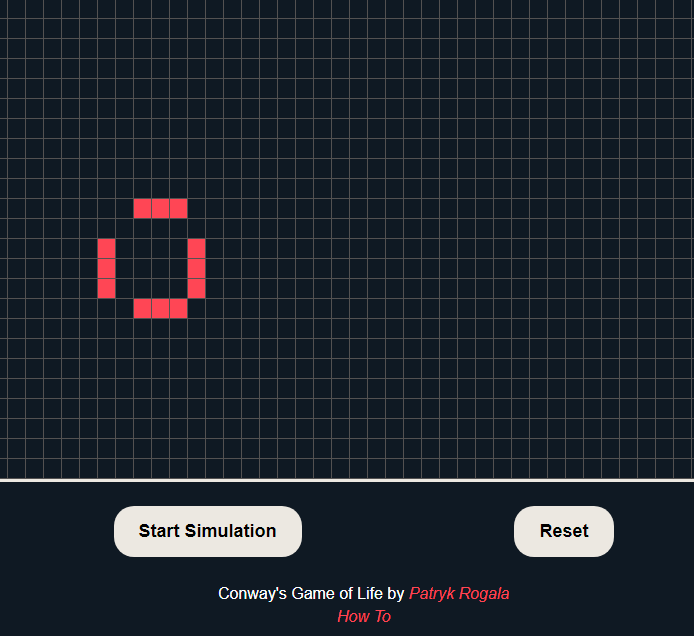

# Conway's Game Of Life [JS]
[Video Demo](https://www.youtube.com/watch?v=92kbJStYIa4&feature=youtu.be)

[Live Demo](https://conways-game-of-life-js.vercel.app)



You can change speed of simulation by editing scripts/game.js
```javascript
let evolutionSpeed = 200; // Change speed here (200 = 200ms)
```

The Game of Life, also known simply as Life, is a cellular automaton devised by the British mathematician John Horton Conway in 1970. It is a zero-player game, meaning that its evolution is determined by its initial state, requiring no further input. One interacts with the Game of Life by creating an initial configuration and observing how it evolves. It is Turing complete and can simulate a universal constructor or any other Turing machine.

More info [HERE](https://en.wikipedia.org/wiki/Conway%27s_Game_of_Life)

## Files
### index.html
Contains whole page structure
```html
<div id="game">
 <!-- MAIN DIV FOR OUR SCRIPT -->
</div>
```

### styles/style.css
Fully responsive styles for webpage.
Should work on any device.
You can submit issues if anything is broken.

### scripts/game.js
Script does not use canva as source. 
I use JS to generate a table with cells of size 20x20 px. 
It generates enough cells to fill 90% of window width and window height so in theory it should be responsive and works fine on mobile devices.
